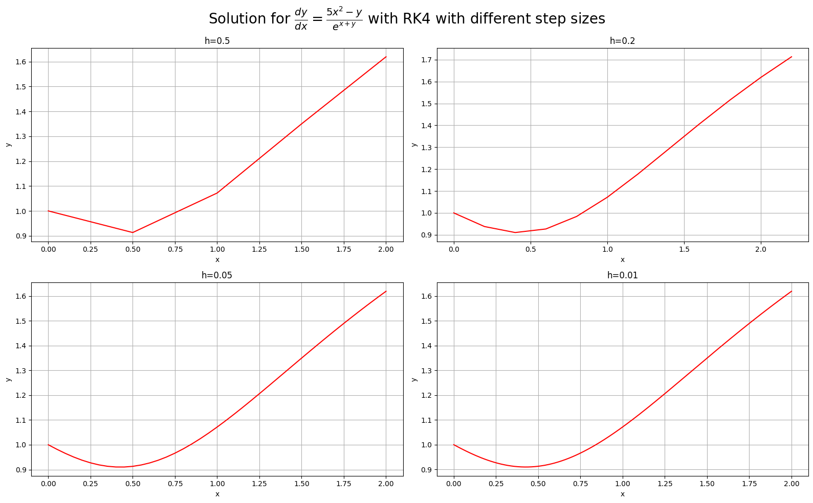

# Question-1
The root of the equation is:  0.5671
The number of steps are:  26

# Question-2
+---------------------+--------------+
|        Method       | Integral (I) |
+---------------------+--------------+
|    Simpson's Rule   |   1.089429   |
|    Midpoint Rule    |   1.089424   |
|   Trapezoidal Rule  |   1.089441   |
| Gaussian Quadrature |   1.089459   |
+---------------------+--------------+

# Question-3
The items in the tables are coordinates (x,y) for each h value. The first value is x and the second value is y.
The complete table is too large to display. Here are the first 5 rows:
+---------------+---------------+----------------+----------------+
|     h=0.5     |     h=0.2     |     h=0.05     |     h=0.01     |
+---------------+---------------+----------------+----------------+
|     (0,1)     |     (0,1)     |     (0,1)      |     (0,1)      |
| (0.5,0.91319) |  (0.2,0.9378) | (0.05,0.98213) | (0.01,0.99634) |
| (1.0,1.07193) | (0.4,0.91044) | (0.1,0.96558)  | (0.02,0.99272) |
| (1.5,1.34978) | (0.6,0.92671) | (0.15,0.9507)  | (0.03,0.98914) |
| (2.0,1.61913) | (0.8,0.98381) |  (0.2,0.9378)  | (0.04,0.98561) |
+---------------+---------------+----------------+----------------+

# Question-4
The value of alpha is taken to be = 0.19999999999999996 
 And for matrix Inversion, the gauss seidel method with 1e-6 tolerence is used.
The table below shows the solution of the heat equation using Crank-Nicholson Method for few time steps
+-----+-----------------+-------------------+-------------------+
|  X  | Time step = 0.0 | Time step = 0.002 | Time step = 0.004 |
+-----+-----------------+-------------------+-------------------+
| 0.0 |       0.0       |        0.0        |        0.0        |
| 0.1 |      0.395      |       0.3987      |       0.401       |
| 0.2 |       0.78      |       0.7785      |       0.7777      |
| 0.3 |      1.155      |       1.153       |       1.1512      |
| 0.4 |       1.52      |       1.518       |       1.516       |
| 0.5 |      1.875      |       1.873       |       1.871       |
| 0.6 |       2.22      |       2.218       |       2.216       |
| 0.7 |      2.555      |       2.553       |       2.551       |
| 0.8 |       2.88      |       2.878       |       2.876       |
| 0.9 |      3.195      |       3.193       |       3.191       |
| 1.0 |       3.5       |       3.498       |       3.496       |
| 1.1 |      3.795      |       3.793       |       3.791       |
| 1.2 |       4.08      |       4.078       |       4.076       |
| 1.3 |      4.355      |       4.353       |       4.351       |
| 1.4 |       4.62      |       4.618       |       4.616       |
| 1.5 |      4.875      |       4.873       |       4.871       |
| 1.6 |       5.12      |       5.118       |       5.116       |
| 1.7 |      5.355      |       5.353       |       5.351       |
| 1.8 |       5.58      |       5.578       |       5.576       |
| 1.9 |      5.795      |       5.793       |       5.791       |
| 2.0 |       6.0       |       5.998       |       5.996       |
| 2.1 |      6.195      |       6.193       |       6.191       |
| 2.2 |       6.38      |       6.378       |       6.376       |
| 2.3 |      6.555      |       6.553       |       6.551       |
| 2.4 |       6.72      |       6.718       |       6.716       |
| 2.5 |      6.875      |       6.873       |       6.871       |
| 2.6 |       7.02      |       7.018       |       7.016       |
| 2.7 |      7.155      |       7.153       |       7.151       |
| 2.8 |       7.28      |       7.278       |       7.276       |
| 2.9 |      7.395      |       7.393       |       7.391       |
| 3.0 |       7.5       |       7.498       |       7.496       |
| 3.1 |      7.595      |       7.593       |       7.591       |
| 3.2 |       7.68      |       7.678       |       7.676       |
| 3.3 |      7.755      |       7.753       |       7.751       |
| 3.4 |       7.82      |       7.818       |       7.816       |
| 3.5 |      7.875      |       7.873       |       7.871       |
| 3.6 |       7.92      |       7.918       |       7.916       |
| 3.7 |      7.955      |       7.953       |       7.951       |
| 3.8 |       7.98      |       7.978       |       7.976       |
| 3.9 |      7.995      |       7.993       |       7.991       |
| 4.0 |       8.0       |       7.998       |       7.996       |
| 4.1 |      7.995      |       7.993       |       7.991       |
| 4.2 |       7.98      |       7.978       |       7.976       |
| 4.3 |      7.955      |       7.953       |       7.951       |
| 4.4 |       7.92      |       7.918       |       7.916       |
| 4.5 |      7.875      |       7.873       |       7.871       |
| 4.6 |       7.82      |       7.818       |       7.816       |
| 4.7 |      7.755      |       7.753       |       7.751       |
| 4.8 |       7.68      |       7.678       |       7.676       |
| 4.9 |      7.595      |       7.593       |       7.591       |
| 5.0 |       7.5       |       7.498       |       7.496       |
| 5.1 |      7.395      |       7.393       |       7.391       |
| 5.2 |       7.28      |       7.278       |       7.276       |
| 5.3 |      7.155      |       7.153       |       7.151       |
| 5.4 |       7.02      |       7.018       |       7.016       |
| 5.5 |      6.875      |       6.873       |       6.871       |
| 5.6 |       6.72      |       6.718       |       6.716       |
| 5.7 |      6.555      |       6.553       |       6.551       |
| 5.8 |       6.38      |       6.378       |       6.376       |
| 5.9 |      6.195      |       6.193       |       6.191       |
| 6.0 |       6.0       |       5.998       |       5.996       |
| 6.1 |      5.795      |       5.793       |       5.791       |
| 6.2 |       5.58      |       5.578       |       5.576       |
| 6.3 |      5.355      |       5.353       |       5.351       |
| 6.4 |       5.12      |       5.118       |       5.116       |
| 6.5 |      4.875      |       4.873       |       4.871       |
| 6.6 |       4.62      |       4.618       |       4.616       |
| 6.7 |      4.355      |       4.353       |       4.351       |
| 6.8 |       4.08      |       4.078       |       4.076       |
| 6.9 |      3.795      |       3.793       |       3.791       |
| 7.0 |       3.5       |       3.498       |       3.496       |
| 7.1 |      3.195      |       3.193       |       3.191       |
| 7.2 |       2.88      |       2.878       |       2.876       |
| 7.3 |      2.555      |       2.553       |       2.551       |
| 7.4 |       2.22      |       2.218       |       2.216       |
| 7.5 |      1.875      |       1.873       |       1.871       |
| 7.6 |       1.52      |       1.518       |       1.516       |
| 7.7 |      1.155      |       1.153       |       1.1512      |
| 7.8 |       0.78      |       0.7785      |       0.7777      |
| 7.9 |      0.395      |       0.3987      |       0.401       |
| 8.0 |       0.0       |        0.0        |        0.0        |
+-----+-----------------+-------------------+-------------------+

# Question-5
The table below shows the solution of the given Poisson's Equation
+----------+-----+----------+----------+----------+----------+----------+-----------+-----------+
|   x/y    | 0.0 | 0.285714 | 0.571429 | 0.857143 | 1.142857 | 1.428571 |  1.714286 |    2.0    |
+----------+-----+----------+----------+----------+----------+----------+-----------+-----------+
|   0.0    | 0.0 | 0.285714 | 0.571429 | 0.857143 | 1.142857 | 1.428571 |  1.714286 |    2.0    |
| 0.285714 | 0.0 | 1.494913 | 1.921214 | 2.183396 | 2.567358 | 3.224273 |  4.381297 |  2.661424 |
| 0.571429 | 0.0 | 4.027401 | 3.965247 | 4.19005  | 4.788627 | 5.851112 |  7.482581 |  3.54159  |
| 0.857143 | 0.0 | 6.206071 | 5.63972  | 5.713012 | 6.399716 | 7.714321 |  9.691236 |  4.712837 |
| 1.142857 | 0.0 | 7.581472 | 6.550646 | 6.457679 | 7.163496 | 8.623251 | 10.885204 |  6.27143  |
| 1.428571 | 0.0 | 7.753787 | 6.358509 | 6.18372  | 6.880793 | 8.34069  | 10.683077 |  8.345468 |
| 1.714286 | 0.0 | 6.034778 | 4.739375 | 4.763099 | 5.469585 | 6.689024 |  8.478621 | 11.105416 |
|   2.0    | 0.0 | 0.776652 | 1.553304 | 2.329956 | 3.106608 | 3.88326  |  4.659912 |  5.436564 |
+----------+-----+----------+----------+----------+----------+----------+-----------+-----------+

